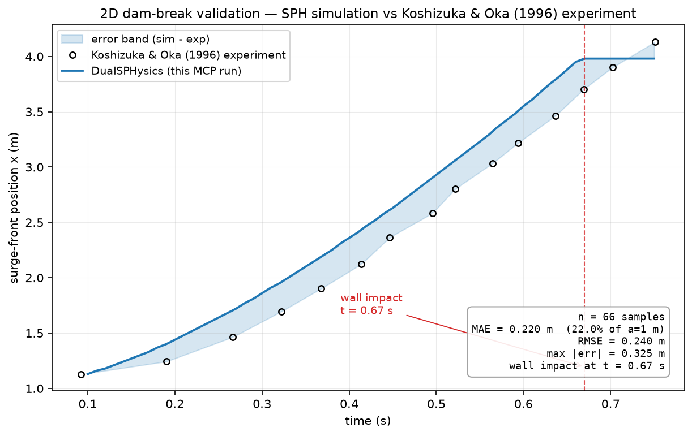

# DualSPHysics MCP

**语言：** [English](README.md) | 中文

[](https://mcpservers.org/servers/vegetableno1/dualsphysics-mcp)
[](https://glama.ai/mcp/servers/vegetableno1/DualSPHysics-mcp)
[](https://github.com/vegetableno1/DualSPHysics-mcp/actions/workflows/ci.yml)

**让 AI agent 设计、运行并验证 DualSPHysics 仿真**——而不只是看动画。

十个 [MCP](https://modelcontextprotocol.io/) 工具把本机
[DualSPHysics](https://dual.sphysics.org/) SPH 工具链完整包起来：用结构化
参数设计案例（不手写 XML，设计阶段不需要求解器）；仿真以后台 CPU 作业
执行，轮询即得进度、吞吐与求解器自估完成时间；后处理输出 ParaView 可
直接打开的 VTK 与 CSV 时序；2D 溃坝对照 Koshizuka & Oka (1996) 实验做
定量验证——逐时刻误差、MAE / RMSE / 最大误差。

本 server 只以子进程方式调用 DualSPHysics 命令行工具，**不分发**
DualSPHysics 本体：DualSPHysics 是 **LGPL-2.1-or-later** 自由软件，本包
不链接、不分发其代码/二进制，MIT 许可证无额外义务。发表工作使用
DualSPHysics 请引用 *Dominguez et al. (2022), Computational Particle
Mechanics 9:867–895, [doi:10.1007/s40571-021-00404-2](https://doi.org/10.1007/s40571-021-00404-2)。*

## 工具

| 工具 | 作用 |
| --- | --- |
| `check_environment` | 在本机找到四个 DualSPHysics 工具：解析路径、来源（环境变量 / PATH / 扫描）、版本、求解器特性；缺哪个给哪个的安装指引。 |
| `create_case` | 用平实参数描述一个 2D 溃坝实验，直接拿回 GenCase 的 `*_Def.xml`——不手写 XML、不需要求解器。附带粒子数估算供自检。 |
| `edit_case` | 修改已有案例的参数（就地或另存 `save_path`），合并后整体重校验。 |
| `describe_case` | 把案例文件读回成摘要：dp、域、水柱/水槽/障碍物、时序、gauges、粒子估算。 |
| `gencase` | 把案例离散化为 `Case.xml` + `Case.bi4`（外加预览 VTK），报告真实粒子数。 |
| `run_case` | **后台**启动 CPU 求解器（jobs/ 目录、`Run.out`、`Part_*.bi4`），立即返回 `job_id`。 |
| `job_status` | 轮询作业：状态、`t`/`tmax`、百分比、求解器 `Time/Sec` 吞吐与自估完成时间、`Run.out` 尾部。 |
| `partvtk` | 把 `Part_*.bi4` 输出转成 ParaView 可用的 VTK 粒子文件；筛选与变量透传。 |
| `measure_tool` | 在给定点位探测解，返回 CSV 时序（强制逗号分隔，解析结果确定）。 |
| `validate_dambreak` | 从 CSV 重建溃坝前锋位置，与内置 Koshizuka & Oka (1996) 序列打分：逐时刻误差 + MAE/RMSE/最大误差。 |

工作链：`check_environment` → `create_case` → `describe_case` → `gencase`
→ `run_case` → 轮询 `job_status` → `partvtk` + `measure_tool` →
`validate_dambreak`。词汇表、三道防线与粒子估算算术见
[docs/case-generation.md](docs/case-generation.md)（英文）。

## 领域契约

各工具 `-h` 里看不出来的行为，最可能先撞上的几条：

- 几何越出域盒会被 GenCase **静默裁剪**（退出码 0、无警告）——`create_case` 因此对每个域做包含性校验。
- DualSPHysics 的 CSV 默认**分号**分隔；`measure_tool` 强制逗号，调用方自带 `-csvsep` 时除外。
- MeasureTool 点位文件不接受行首 `#` 注释行；MeasureTool 的报错打在 **stdout** 而非 stderr。
- `Run.out` 里的 `Time/Sec` 是"每模拟秒的墙钟秒数"——不是步/秒；行尾是求解器自估的完成时间。
- `Run.out` 行格式在求解器 v5.0/v5.2 与 v5.4 之间不同；解析器两者兼容。

全部契约（十四条，格式与退出码）见 [docs/domain-contracts.md](docs/domain-contracts.md)（英文）。

## 安装

Python 3.10+。DualSPHysics 二进制从 `DSPH_*` 环境变量、PATH 或常规安装根
（`/opt`、`/usr/local`、`~/softwares`、`~`、当前目录 → `<根>/DualSPHysics*/bin/linux`）发现。

```bash
uv sync                 # 或：python -m venv .venv && .venv/bin/pip install -e .
```

获取求解器（GitHub 仓预编译了 GenCase / PartVTK / MeasureTool，但**不含**
求解器）：

1. 官网完整包 <https://dual.sphysics.org/downloads/>，或
2. `git clone https://github.com/DualSPHysics/DualSPHysics` 后用
   `make -f Makefile_cpu` 编译 CPU 版求解器（仅需 g++，无需 CUDA），再拷
   `bin/linux/` 下的预编译工具。

用环境变量配置（不做 .env 解析；变量清单见 `.env.example`，同款路径亦见
`examples/mcp_config.example.json`）：

```
DSPH_GENCASE=/home/<user>/softwares/DualSPHysics/bin/linux/GenCase_linux64
DSPH_SOLVER=/home/<user>/softwares/DualSPHysics/bin/linux/DualSPHysics5.4CPU_linux64
DSPH_PARTVTK=/home/<user>/softwares/DualSPHysics/bin/linux/PartVTK_linux64
DSPH_MEASURETOOL=/home/<user>/softwares/DualSPHysics/bin/linux/MeasureTool_linux64
DSPH_JOBS_DIR=/绝对路径/jobs      # 可选，默认 ./jobs
DSPH_OMP_THREADS=8               # 可选，默认全部核心
```

## 运行

```bash
.venv/bin/python mcp_server.py    # hub 风格入口（stdio）
.venv/bin/dualsphysics-mcp        # console script
uvx dualsphysics-mcp              # 已发布到 PyPI
```

客户端注册模板见 [`examples/mcp_config.example.json`](examples/mcp_config.example.json)：

```json
{ "mcpServers": { "dualsphysics-mcp": { "command": "uvx", "args": ["dualsphysics-mcp"] } } }
```

```bash
claude mcp add dualsphysics-mcp -- /绝对路径/.venv/bin/python /绝对路径/mcp_server.py
```

## 示例：2D 溃坝验证（Koshizuka & Oka 1996）

`examples/dambreak_val2d/` 是亮相案例：官方验证布局（dp = 0.01 m；
1 m × 2 m 水柱置于 4 m × 3 m 水箱；TimeMax = 2 s、TimeOut = 0.01 s；
Verlet / Wendland / 人工粘度 0.02 / Fourtakas DDT 0.1），由
`gen_dambreak_val2d.py` 程序化再生成（MIT）、追踪前锋的 MeasureTool
点位文件（z = 0.03 m 线上 401 个点）、以及数字化实验序列。

本案例实测数值（GenCase v5.4.354 / 求解器 v5.4.355，8 CPU 线程，
i5-10210U）：

| 量 | 值 |
| --- | --- |
| 总粒子数 | **21,001**（流体 20,000 + 边界 1,001） |
| Part 文件 | 201 个（`Part_0000` … `Part_0200`） |
| 求解墙钟时长（TimeMax = 2 s） | 约 14 分钟 |
| 前锋 MAE vs 实验（0.09–0.75 s） | **0.220 m**（水柱的 22.0 %）；RMSE **0.240 m** |
| 前锋误差，坍塌早期（t ≤ 0.2 s） | 在 ±0.01–0.16 m 内 |
| 撞壁 | 前锋于 t ≈ **0.67 s** 钉在 3.98 m |



残差是 SPH 物理本身，不是测量方法的问题：前锋提取与求解器自带的 SWL
gauge 交叉核对过（平均偏差 8 mm，小于 10 mm 点距），且实验序列止于
X/a ≈ 4.13、超出 4 m 水箱，撞壁后对比饱和——`validate_dambreak` 会给出
`impact_time_s` 并在 `notes` 中说明。

Agent 操作序列：

```
check_environment()                                  # 四个工具全部找到
gencase("examples/dambreak_val2d/CaseDambreakVal2D_Def.xml")
  -> particle_counts: total=21001 fluid=20000 bound=1001
run_case("<out>/CaseDambreakVal2D")                  # 返回 job_id
job_status(job_id)                                   # 轮询到 percent=100
partvtk(job_id=job_id)                               # 201 个流体 VTK
measure_tool(job_id=job_id, points_file="examples/dambreak_val2d/points_damtip.txt")
validate_dambreak(csv_path="<measure csv>", points_file="examples/dambreak_val2d/points_damtip.txt")
```

`validate_dambreak` 返回逐时刻误差与 MAE / RMSE / 最大误差（米，及占
1 m 水柱的百分比）。上图由 `examples/make_validation_figure.py` 生成；
`examples/render_dambreak.py` 可把同一轮的 `Part_*.vtk` 渲染成 MP4 动画
（dev 依赖）。

## 测试

```bash
uv run pytest -q          # 或：.venv/bin/python -m pytest
uv run ruff check .
```

**无求解器环境全套全绿**（工具发现、命令构造、日志样本解析、验证数学、
案例生成、stdio 端到端）。标记 `solver` 的用例在本机装有工具链时额外
实测，否则自动跳过。

## 目录

- `src/dualsphysics_mcp/` —— MCP server、工具发现与配置、错误码、`tools/` 下的十个工具。
- `examples/` —— 验证案例、`create_case_demo.py`、对比图/动画脚本、客户端注册模板。
- `tests/` —— pytest 套件（求解器用例自动跳过）。

## 仓库规则

- 入库：源码、测试、示例、文档、模板。
- 不入库：DualSPHysics 二进制或源码（LGPL 本体不进来）、虚拟环境、`.env`、作业输出与生成结果。
- `examples/dambreak_val2d/` 中的实验数值为注明 Koshizuka & Oka (1996) 出处的数字化事实（随 DualSPHysics 示例分发）；生成的案例 XML 与全部代码为本仓库原创 MIT 内容——细则见 [CONTRIBUTING.md](CONTRIBUTING.md)。
